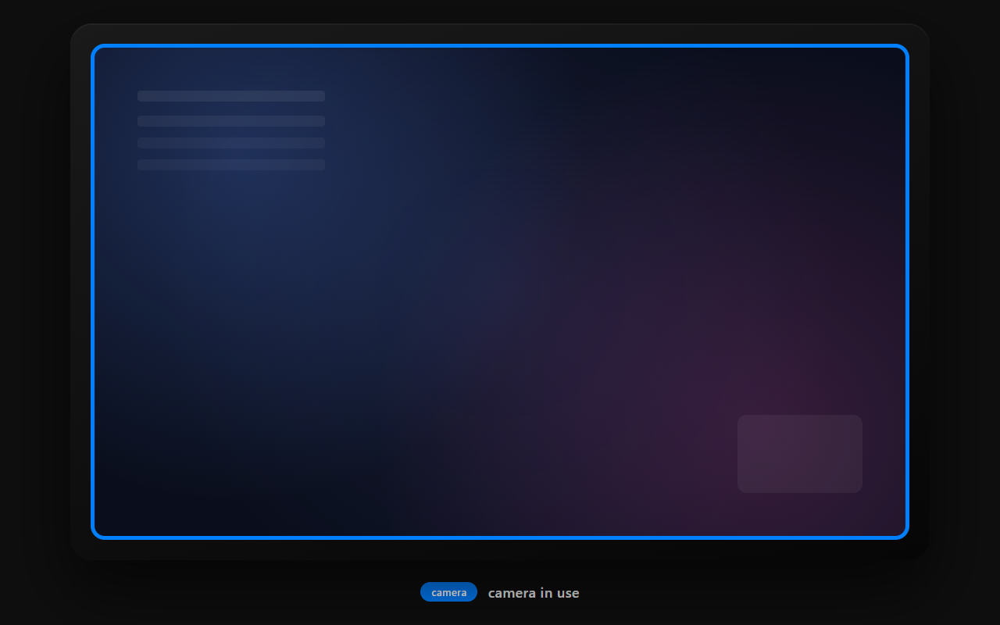
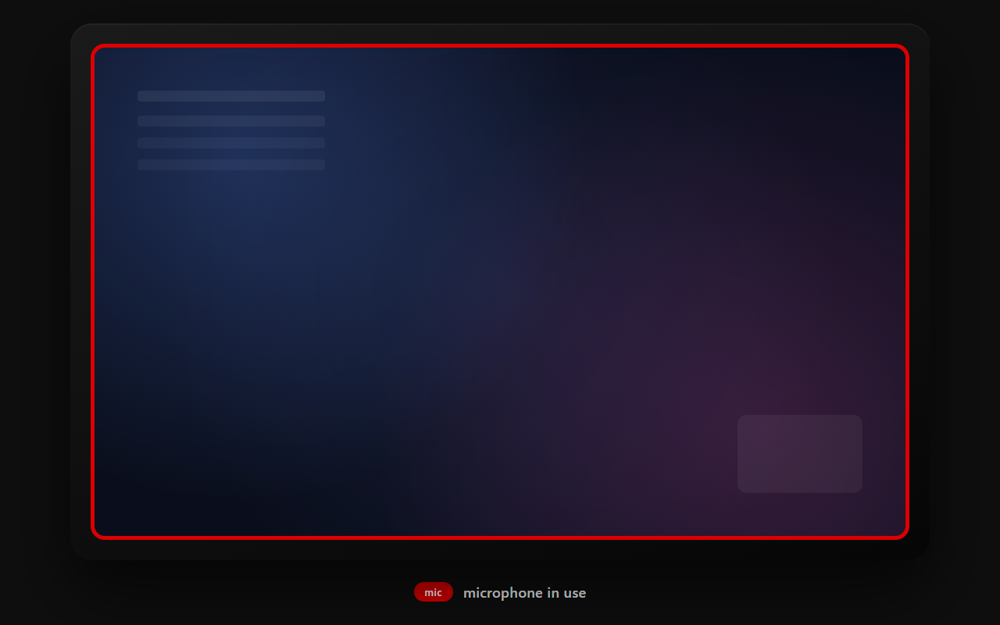
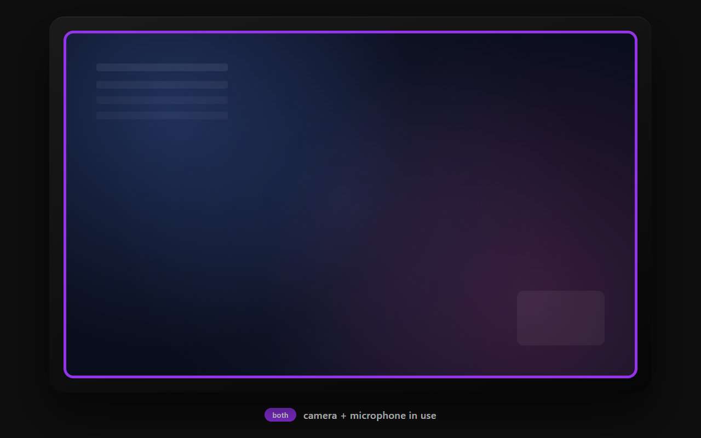

<p align="center">
  
</p>

<p align="center">
  <picture>
    <source media="(prefers-color-scheme: dark)" srcset="assets/title-dark.svg">
    
  </picture>
</p>

<p align="center"><em>Tray app that paints a thin colored border around your primary monitor whenever your camera or microphone is in use.</em></p>

<p align="center">
  
  
  
  
  
  
</p>

---

<p align="center">
  
  
  
</p>

**Blue** for camera, **red** for mic, **purple** for both. The border fades smoothly on every transition, hugs your laptop's rounded screen corners, and is click-through — nothing under it stops working. The tray icon snaps to the matching state without an animation.

## Why

Modern apps light up the webcam or pick up audio from the mic without making it obvious. Windows 11 shows a tiny privacy indicator in the system tray, but it's easy to miss. HotMic gives you a peripheral-vision signal you can't ignore.

## Install

1. Grab `dist\hotmic.exe` (~420 KB).
2. Put it somewhere stable on your machine — `%LOCALAPPDATA%\Programs\HotMic\hotmic.exe` is a good spot. **Don't run it from a temp folder**, because the autostart entry will save the exact path you launched from and break if the file moves later.
3. Double-click to run. A microphone icon shows up in the system tray.
4. Optional: right-click the tray icon → **Start with Windows**. From then on it launches at logon.

No installer, no service, no admin rights, no .NET / Visual C++ runtime. The exe is self-contained.

**First-launch SmartScreen warning.** The exe is unsigned, so the first time you run it Windows SmartScreen will say "Windows protected your PC". Click *More info* → *Run anyway*. To avoid this on managed corporate machines, you'd need a code-signing certificate; that's out of scope for this build.

## Uninstall

1. Right-click the tray icon → **Exit**. (If autostart is enabled, also right-click → uncheck **Start with Windows** first, so the next logon doesn't relaunch it.)
2. Delete `hotmic.exe` wherever you put it.
3. If you skipped step 1's autostart-disable, also delete `HKCU\Software\Microsoft\Windows\CurrentVersion\Run\HotMic` via `regedit` to prevent Windows from trying to launch the missing exe on next logon.

## Use

It's passive. As soon as something opens the camera or microphone, the screen border lights up and the tray icon changes color. When the device closes, the border disappears.

The tray menu (right-click) has:
- **Enabled** — toggles the border on/off without exiting the app
- **Start with Windows** — toggles the HKCU Run-key entry
- **Exit** — quits

## Troubleshooting

**Border doesn't appear when I open the camera.** Check that the app in question goes through `CapabilityAccessManager`: open `regedit` and look under `HKCU\SOFTWARE\Microsoft\Windows\CurrentVersion\CapabilityAccessManager\ConsentStore\webcam` while the camera is active. If your app isn't listed there, it's using one of the legacy paths HotMic doesn't watch. Some older capture tools and a few games fall into this bucket.

**Border appears in the wrong place / corners don't match my screen.** The corner radius is hardcoded to 12 logical pixels. If your laptop's display has a tighter or wider curve, edit `CORNER_RADIUS_LOGICAL` in `src/lib.rs` and rebuild.

**Border is too thin / too thick.** Edit `BORDER_THICKNESS_LOGICAL` (also `src/lib.rs`), default 3, and rebuild.

**Autostart is broken after I moved the exe.** Right-click the tray icon → toggle **Start with Windows** off, then on again. That re-writes the Run-key with the new path.

## How it detects things

Windows writes per-app device-usage state to the registry under:

```
HKCU\SOFTWARE\Microsoft\Windows\CurrentVersion\CapabilityAccessManager\ConsentStore\{webcam,microphone}
HKLM\SOFTWARE\Microsoft\Windows\CurrentVersion\CapabilityAccessManager\ConsentStore\{webcam,microphone}
```

Each app gets a subkey with a `LastUsedTimeStop` value. While the app holds the device, the value is `0`; once it's released, it gets a real FILETIME. HotMic walks both hives, watches all four roots with `RegNotifyChangeKeyValue`, and reads the values when a change fires.

**What this catches**: Teams, Zoom, Chrome/Edge/Firefox, Slack, Discord, the Windows Camera app, and basically any modern UWP or Electron-based app that goes through the capability access manager.

**What it does not catch**: legacy apps using raw DirectShow or older WASAPI paths that skip the consent store entirely (some older capture tools, a few games). This is a known limitation. Detecting those paths would require hooking MMDevice and Media Foundation directly, which is materially more code without changing detection for any of the apps listed above.

## How it draws the border

A single full-screen layered window covers the primary monitor. The window uses color-key transparency (magenta is the key) so most of it is invisible — only the pixels actually painted in the border color show up. Layered alpha is also enabled so the whole border can be animated.

In `WM_PAINT` the border is drawn as one stroked `RoundRect` (single GDI call) in the current state color: blue for camera, red for mic, purple for both. The rounded corners follow your laptop's screen curve.

Corner radius is **12 logical pixels** by default — change `CORNER_RADIUS_LOGICAL` in `src/lib.rs` if your screen's curve is different. Thickness is **3 logical pixels**, scaled by DPI at draw time.

The fade animation runs on a `WM_TIMER` ticking at 60 Hz; layered-window alpha steps from 0 → 255 (or back) in 8 ticks, so appear/disappear takes about 128 ms. The window is hidden once the disappear animation completes.

The window has `WS_EX_TRANSPARENT` and `WS_EX_NOACTIVATE`, so all input passes through it and it never steals focus. It reasserts `HWND_TOPMOST` in `WM_WINDOWPOSCHANGING` because Windows occasionally demotes topmost windows on virtual-desktop or UAC transitions.

## Build

All builds happen in Docker. Nothing is installed on the host beyond Docker itself.

```powershell
.\build.ps1
```

That script:
1. Builds the `hotmic-builder` image (Rust 1 + mingw-w64 cross-compiler, ~20 s first time, cached after)
2. Runs `cargo build --release --target x86_64-pc-windows-gnu` inside the container
3. Copies the resulting exe to `dist\hotmic.exe`

The first run pulls and builds the image. Subsequent runs reuse it and finish in seconds.

### Regenerating the tray icons

Source SVGs live in `icons\tray-{idle,cam,mic,both}.svg`. The `.ico` files are derived. To regenerate after editing an SVG:

```powershell
docker run --rm -v "${PWD}:/work" -w /work debian:bookworm-slim bash -c "
  apt-get update -qq && apt-get install -y -qq --no-install-recommends librsvg2-bin imagemagick &&
  for n in idle cam mic both; do
    for s in 16 20 24 32 40 48 64; do
      rsvg-convert -w \$s -h \$s -b none icons/tray-\${n}.svg -o /tmp/\${n}-\${s}.png
    done
    convert /tmp/\${n}-16.png /tmp/\${n}-20.png /tmp/\${n}-24.png /tmp/\${n}-32.png /tmp/\${n}-40.png /tmp/\${n}-48.png /tmp/\${n}-64.png icons/tray-\${n}.ico
  done
"
```

Each `.ico` packs seven native resolutions so Windows can pick the best size for the active tray DPI (`LoadIconMetric(LIM_SMALL)` does the selection at runtime).

## Tests

Pure logic — color matrix, DPI scaling, registry value parsing, wide-string helpers — lives in `src/lib.rs` and runs natively on the build container's host target (Linux ARM/x64). The Win32 surface (windowing, registry I/O, tray) can't be unit-tested without running on Windows; that's covered by your manual smoke test.

```powershell
docker run --rm -v "${PWD}:/work" -w /work hotmic-builder cargo test --lib
```

29 tests as of this writing. Format, clippy, tests, and build all run cleanly:

```powershell
docker run --rm -v "${PWD}:/work" -w /work hotmic-builder bash -c "
  cargo fmt --check &&
  cargo clippy --lib -- -D warnings &&
  cargo clippy --bin hotmic --target x86_64-pc-windows-gnu -- -D warnings &&
  cargo test --lib &&
  cargo build --release --target x86_64-pc-windows-gnu
"
```

## Project layout

```
hotmic/
├── Cargo.toml              # windows = 0.62, embed-resource = 3
├── Cargo.lock
├── .cargo/config.toml      # static-link mingw runtime; -static-libgcc
├── Dockerfile              # rust:1-bookworm + mingw + clippy + rustfmt
├── build.ps1               # one-shot Docker build + copy to dist/
├── build.rs                # embeds app.rc resources into the exe
├── app.rc                  # RT_MANIFEST + 4 icon resources
├── app.manifest            # PerMonitorV2 DPI, asInvoker, common controls v6
├── src/
│   ├── main.rs             # tray, menu, message loop, autostart, mutex
│   ├── lib.rs              # pure helpers + unit tests
│   ├── overlay.rs          # full-screen layered window + GDI border drawing
│   ├── detect.rs           # registry walk + RegNotifyChangeKeyValue watcher
│   └── autostart.rs        # HKCU Run-key read/write/delete
├── icons/
│   ├── tray-{idle,cam,mic,both}.svg
│   └── tray-{idle,cam,mic,both}.ico
├── design/
│   └── mockup.html         # renders the README screenshots; not used at runtime
├── dist/
│   └── hotmic.exe          # shipped artifact
└── target/                 # cargo build cache (gitignored)
```

## Architecture

```
              ┌────────────────────────────────────────────────────────┐
              │            Windows  CapabilityAccessManager            │
              │        HKCU + HKLM   webcam | microphone               │
              └───────────────────────────┬────────────────────────────┘
                                          │ change events
                                          ▼
  ┌────────────────────────────────────────────────────────────────────────┐
  │  HotMic process (single thread)                                        │
  │                                                                        │
  │    ┌────────────────────────────────────────────────────────────────┐  │
  │    │ Watcher   4× RegNotifyChangeKeyValue  +  500 ms backstop poll  │  │
  │    └──────────────────────────────┬─────────────────────────────────┘  │
  │                                   ▼                                    │
  │    ┌────────────────────────────────────────────────────────────────┐  │
  │    │ Message loop   MsgWaitForMultipleObjectsEx                     │  │
  │    └──────────────────────────────┬─────────────────────────────────┘  │
  │                                   ▼                                    │
  │    ┌────────────────────────────────────────────────────────────────┐  │
  │    │ apply_state   150 ms off-debounce,  (cam, mic) → color         │  │
  │    └─────────────┬───────────────────────────────────┬──────────────┘  │
  │                  │ color + visibility                │ icon + tooltip  │
  │                  ▼                                   ▼                 │
  │    ┌──────────────────────┐               ┌──────────────────────┐     │
  │    │ Overlay window       │               │ Tray icon            │     │
  │    │ layered + click-     │               │ Shell_NotifyIcon     │     │
  │    │ through, GDI rounded │               │                      │     │
  │    │ rect, ~128 ms fade   │               │                      │     │
  │    │ @ 60 Hz              │               │                      │     │
  │    └──────────┬───────────┘               └──────────┬───────────┘     │
  └───────────────│─────────────────────────────────────│──────────────────┘
                  │ colored border                       │ state icon
                  ▼                                      ▼
         ┌──────────────────┐                 ┌──────────────────┐
         │ Primary monitor  │                 │ System tray      │
         └──────────────────┘                 └──────────────────┘
```

One process, one thread. The registry tells us when a device opens or closes; the message loop turns that into a colored border on the screen and a state-matching icon in the tray.

### Event-driven, not polling

The watcher (`src/detect.rs`) opens four registry keys (HKCU + HKLM × webcam + microphone) and creates a manual-reset event per key. It arms `RegNotifyChangeKeyValue` on each with subtree-recursive watching and `REG_NOTIFY_THREAD_AGNOSTIC`. The main message loop uses `MsgWaitForMultipleObjectsEx` to block on the four events and the message queue simultaneously, so between events the message-loop thread parks in the kernel and reacts within milliseconds when a registry value changes.

A 500 ms backstop `WM_TIMER` covers the rare case where `CapabilityAccessManager` writes don't trigger a `RegNotifyChangeKeyValue` callback (sometimes the kernel coalesces deeply-nested changes). A 150 ms off-debounce prevents the border from flickering during the brief stop/start that some apps do while negotiating device formats.

### Single instance

The app calls `CreateMutexW` on `Local\HotMic-Singleton` at startup. If the mutex already exists, the second instance exits immediately. This prevents a slow logon from spawning two tray icons.

### Autostart

Toggling **Start with Windows** writes the current exe path (as `"\"...\""`) to `HKCU\Software\Microsoft\Windows\CurrentVersion\Run\HotMic`. HKCU means no admin elevation. The Run-key is per-user, so the autostart only applies to the account that toggled it.

If you move `hotmic.exe`, the Run-key still points at the old path and autostart will fail silently. Re-toggle the menu item to refresh it.

## Configuration

There's no settings file. The two values you might want to tune are constants in `src/lib.rs`:

| Constant | Default | What it controls |
|---|---|---|
| `BORDER_THICKNESS_LOGICAL` | 3 | Border line thickness in logical pixels (scales with DPI) |
| `CORNER_RADIUS_LOGICAL` | 12 | Corner curve radius — match your laptop's screen rounding |

Change either, rebuild via `.\build.ps1`, relaunch.

## Security posture

- **No elevation** — `asInvoker` in the manifest. Runs entirely as the current user.
- **No network** — the app has no networking code and doesn't load any libraries that do.
- **HKCU/HKLM read-only for detection** — only opens the two registry trees with `KEY_READ | KEY_NOTIFY`. The only writes are to the optional autostart Run-key, which is HKCU and per-user.
- **No input capture** — the overlay window is `WS_EX_TRANSPARENT` + `WS_EX_NOACTIVATE`, so all keyboard/mouse input passes through it untouched.
- **No external execution** — the app never launches subprocesses or shells out.

It's a passive indicator. It can't itself prevent the camera or mic from being opened.

## Known limitations

- **Primary monitor only.** Multi-monitor support would mean tracking each monitor's bounds and DPI separately and managing multiple overlay windows. Out of scope for the current design.
- **Legacy DirectShow / older WASAPI apps not detected.** See "How it detects things" above.
- **Full-screen exclusive apps cover the border.** Acceptable: those apps aren't really compatible with any topmost indicator.
- **Move the exe → autostart breaks.** Re-toggle the menu item to fix.

## License

MIT. See [LICENSE](LICENSE).
