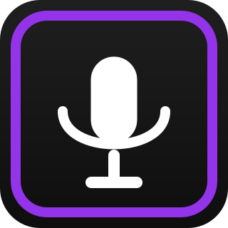
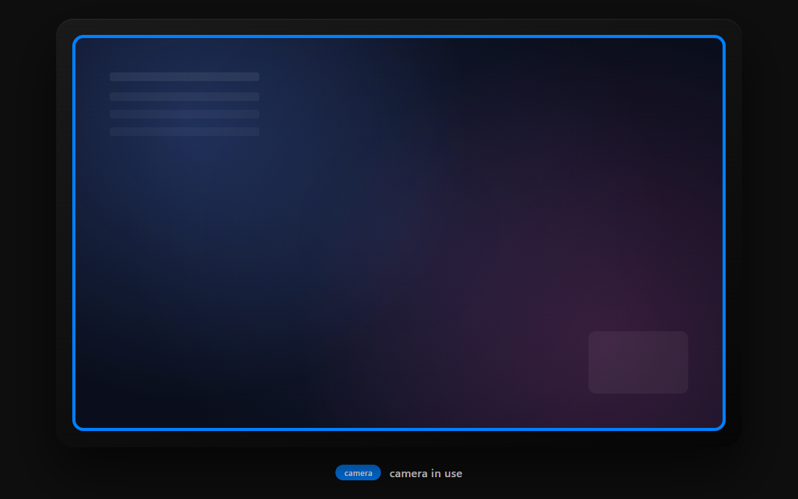
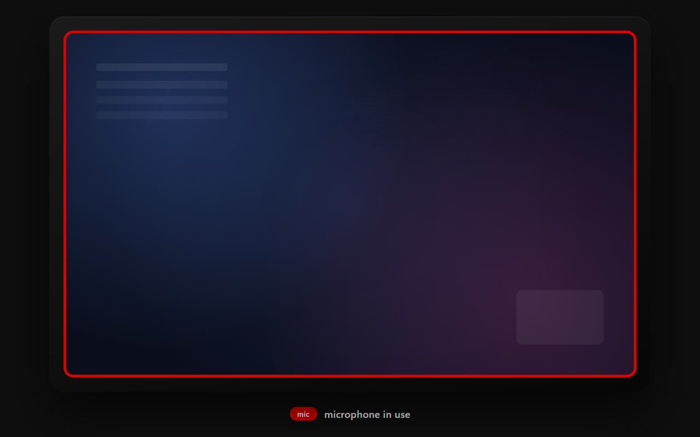
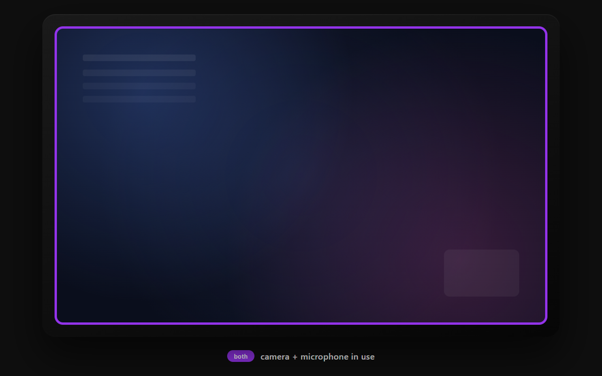

<p align="center">
  
</p>

<p align="center">
  <picture>
    <source media="(prefers-color-scheme: dark)" srcset="assets/title-dark.png">
    
  </picture>
</p>

<p align="center"><em>Windows tray app that shows camera and microphone activity with a colored border on your primary monitor. Reads Teams meeting controls even when Windows device-usage records are stale.</em></p>

<p align="center">
  
  
  
  
  
  
  
</p>

---

<p align="center">
  
  
  
</p>

**Blue** for camera, **red** for mic, **purple** for both. The click-through border has rounded corners and fades in and out. Color changes and tray-icon updates do not wait for a fade.

## Why

Modern apps light up the webcam or pick up audio from the mic without making it obvious. Windows 11 shows a tiny privacy indicator in the system tray, but it's easy to miss. HotMic gives you a peripheral-vision signal you can't ignore.

## Install

1. Run this checkout's `dist\hotmic.exe` (roughly 0.5 MB). To rebuild it from source, follow [Build](#build).
2. Find the microphone icon in the system tray, including the hidden-icons area if necessary.
3. Optional: right-click the icon > **Start with Windows**. Subsequent logons launch that same `dist\hotmic.exe` path.

Run it directly from the repo's `dist\` folder. The autostart entry records the absolute path you launched from, so don't move or rename the folder afterwards. If you do, re-toggle **Start with Windows** to refresh the path.

No installer, no service, no admin rights, no .NET / Visual C++ runtime. The exe is self-contained.

**SmartScreen and managed devices.** The exe is unsigned, so Windows may warn or an organization policy may block it. Only run a binary from a source you trust. Follow your organization's approval process rather than changing security policy to run it.

### Updating an Existing Copy

1. Right-click the HotMic tray icon > **Exit**. Opening a second copy will not replace the running one because HotMic enforces a single instance.
2. Keep a backup outside tracked files if you need rollback, then replace or rebuild `dist\hotmic.exe`. A running copy locks that file; a copy running from `target\` can also lock the build output.
3. Launch `dist\hotmic.exe` again and check the Teams color states below. Teams itself does not need to be restarted or re-paired for the meeting-control fallback.

Keeping the same executable path preserves the autostart entry. Changes to the source files alone do not update an already running process.

## Uninstall

1. If enabled, uncheck **Start with Windows**, then choose **Exit** from the tray menu.
2. Delete the HotMic executable you were running. Repository cleanup is not required.
3. If you skipped step 1's autostart-disable, also delete `HKCU\Software\Microsoft\Windows\CurrentVersion\Run\HotMic` via `regedit` to prevent Windows from trying to launch the missing exe on next logon.
4. Optional: clear the Teams pairing state by deleting `%LOCALAPPDATA%\HotMic\` (contains `teams.token` and, if debug logging was on, `teams-debug.log`).

## Use

HotMic is a passive indicator. It combines Windows consent-store records, passive native capture metadata, and readable Teams meeting controls, including eligible Teams pages in Edge and Chrome. Native camera/microphone observations and joined Teams meetings can establish activity independently of stale registry records. See [Known Limitations](#known-limitations) for cases the detector cannot cover.

For a joined meeting with readable, consistent Teams state and no additional activity reported by the registry or native fallback:

| Teams Camera | Teams Microphone | Border |
|---|---|---|
| On | Live | Purple |
| On | Muted | Blue |
| Off | Live | Red |
| Off | Muted | None |

Registry and native activity are additive: another app's capture or a stale active registry record can keep a color visible. The border is not proof that media is being saved or transmitted, and its absence is not a privacy guarantee.

The tray menu (right-click) has:
- **Enabled**: toggles the border on/off without exiting the app
- **Start with Windows**: toggles the HKCU Run-key entry
- **Exit**: quits

##  Microsoft Teams Setup

Teams can retain microphone capture while muted, so device-usage records alone do not establish in-app mute state. They can also remain stale during an active call. HotMic combines an optional Local API connection with independent, read-only Windows UI Automation observations.

### Desktop Teams And Teams On The Web

The meeting-control fallback needs no API pairing. HotMic reads visible desktop `TeamsWebView` windows and these controls without clicking them:

| Automation ID | Interpretation |
|---|---|
| `hangup-button` | An enabled control establishes a joined meeting. |
| `microphone-button` | `Unmute mic` means muted; `Mute mic` means live. |
| `video-button` | `Turn camera off` means camera on; `Turn camera on` means camera off. |

These observations do not depend on the registry first reporting activity or on the Local API being absent. Pre-join previews and hidden WebViews do not establish fallback meeting activity. Minimized windows are still scanned when Windows reports them as visible, but detection depends on Teams exposing the controls and remains on the manual checklist. A preview may still produce a border through normal registry activity.

For **Edge and Chrome**, HotMic checks visible `Chrome_WidgetWin_1` windows owned by `msedge.exe` or `chrome.exe`. It reads each exposed top-level document's URL in memory and requires an HTTPS origin of `teams.microsoft.com`, `teams.cloud.microsoft`, or `teams.live.com` before querying the same three controls. A page title containing "Teams" is not enough. URLs, tab titles, and meeting content are not logged.

Keep the meeting selected in its own browser window. A background tab that the browser removes from its accessibility tree cannot be detected through this fallback. Minimized-window support also depends on the browser continuing to expose the document and controls. No tab is selected, focused, or opened by HotMic.

Browser meeting state is independent of the desktop Local API: an idle or muted desktop client cannot hide a live browser call. Browser capture reported by the registry remains additive, however. HotMic cannot attribute that capture to a particular tab, so muting Teams on the web does not suppress an active browser registry record.

Browser detection was added after v0.2.4. Rebuild and restart HotMic to test this source change; a stock v0.2.4 executable has the desktop-only detector. The user has confirmed all three browser border colors; the remaining live checks are listed below.

The UI snapshot is polled by a 500 ms timer. UI Automation call time and message-loop scheduling add latency; this is not a 500 ms response-time guarantee. Transitions to no visible devices also have a 150 ms debounce and a fade lasting about 128 ms under normal timer scheduling.

### Optional Local API With Manage API

If your Teams build shows **Manage API** under **Settings > Privacy**, you can enable the event-driven API:

1. Open **Settings > Privacy > Manage API** and turn on **Enable API**.
2. Start a Teams meeting while HotMic is running.
3. Click **Allow** when Teams asks whether HotMic may connect.

A complete Local API state takes precedence for desktop meeting membership and mute state, not browser meetings. Camera fallback still comes from the meeting controls. HotMic stores a returned pairing token DPAPI-wrapped at `%LOCALAPPDATA%\HotMic\teams.token` and reuses it on later connections.

### Local API Re-Pairing

On builds that expose the Local API, HotMic clears a stored token and requests pairing when Teams advertises `canPair:true` again. This can follow changes such as:

- You removed HotMic from Teams' allowed-apps list.
- You signed into Teams as a different user.
- You reinstalled Teams.

If Teams displays the Allow banner again, approve it to restore Local API access. This pairing flow is separate from the meeting-control fallback.

To request a fresh Local API pair, exit HotMic, delete `%LOCALAPPDATA%\HotMic\teams.token`, relaunch HotMic, and start a meeting in a Teams build that offers the API. Deleting the token is not a remedy for stale consent-store records and is unnecessary for UI Automation.

### If the Border Still Doesn't Clear On Mute

1. **Are the supported controls exposed?** The fallback needs a desktop `TeamsWebView` or a verified Teams document in Edge/Chrome, plus the control IDs above. Background browser tabs and other client variants may not expose them.
2. **Is Teams using English UI labels?** The microphone parser recognizes `Mute` and `Unmute`. In a confirmed meeting, unknown or conflicting readings do not justify suppressing the microphone indicator.
3. **Does your build still show Manage API?** If so, enable it and approve HotMic as described above. The Local API does not depend on UI language.
4. **Check other capture.** A separate app's registry-reported microphone use keeps the red component visible even when Teams is muted. Browser registry records are not attributed to individual tabs and are never suppressed by Teams mute.

### Local API Debug Logging

For Local API connection or pairing problems, exit HotMic and relaunch from PowerShell with `$env:HOTMIC_TEAMS_DEBUG = "1"; .\dist\hotmic.exe`. The log is written to `%LOCALAPPDATA%\HotMic\teams-debug.log` and truncated when it grows past 256 KB. Remove the environment variable before future launches to disable logging.

This log covers the WebSocket client, not UI Automation control snapshots, so it is not a general detector-health report. Token redaction is implemented, but review any log locally for sensitive content before sharing it. Never share `teams.token`.

### What HotMic Does And Does Not Do With Teams

- **Reads** `isInMeeting` and `isMuted` from the Local API when Teams exposes it.
- **Reads meeting controls** for independent camera and microphone activity when registry timestamps are stale. Only the hangup, microphone, and video controls are queried after identifying the desktop window or checking a browser document's origin.
- **Never clicks or invokes** a Teams control. UI Automation access is read-only.
- **Sends** the Local API connection handshake and pairing request when applicable, plus protocol pong and close frames. Pairing can be requested again after authorization changes.
- **Never sends** `toggle-mute`, `leave-call`, `toggle-video`, or any other write action. Although the token Teams hands us grants WRITE access, `src/teams.rs` exposes no public method that produces any of those payloads. See [Security Posture](#security-posture) for the full constraint list.

## Troubleshooting

**No border for any app.** Check that HotMic is running, **Enabled** is checked, and you are looking at the primary monitor. Exit and relaunch HotMic after replacing its executable; starting another copy alone has no effect.

**No border during a Teams meeting even though camera and mic are on.** v0.2.4 introduced independent desktop Teams detection; browser detection requires a build containing the later source change described above. Exit and relaunch HotMic after replacing an older executable. Join the meeting rather than staying in its preview. The fallback needs a compatible desktop window or verified Edge/Chrome document, readable controls, and recognized camera-action labels. For Teams on the web, keep its tab selected in a separate browser window. Old `LastUsedTimeStop` values do not block these independent Teams paths.

**No border for a non-Teams camera or microphone.** Use a build containing the native capture fallback described below, not a stock v0.2.4 binary. Stale stopped registry records cannot establish live activity, but Media Foundation sensor reports and Core Audio capture-session states can supplement them. Missing media components, unavailable providers, or capture paths they do not report can still leave no usable signal. No device is opened to test whether it is busy.

**Red mic border stays on after I muted in Microsoft Teams.** See [Microsoft Teams Setup](#microsoft-teams-setup), including duplicate/unknown control readings and other apps using the microphone. HotMic does not integrate with other VoIP apps' mute controls; their capture streams can remain open while muted.

**Border appears in the wrong place / corners don't match my screen.** The corner radius is hardcoded to 12 logical pixels. If your laptop's display has a tighter or wider curve, edit `CORNER_RADIUS_LOGICAL` in `src/lib.rs` and rebuild.

**Border is too thin / too thick.** Edit `BORDER_THICKNESS_LOGICAL` (also `src/lib.rs`), default 3, and rebuild.

**Autostart is broken after I moved or rebuilt the repo somewhere else.** The Run-key records the absolute path you originally launched from. Right-click the tray icon > toggle **Start with Windows** off, then on again. That re-writes the Run-key with the current `dist\hotmic.exe` path.

## How It Detects Things

The registry detector reads per-app device-usage records under:

```
HKCU\SOFTWARE\Microsoft\Windows\CurrentVersion\CapabilityAccessManager\ConsentStore\{webcam,microphone}
HKLM\SOFTWARE\Microsoft\Windows\CurrentVersion\CapabilityAccessManager\ConsentStore\{webcam,microphone}
```

HotMic interprets an eight-byte `LastUsedTimeStop` value of `0` as reported activity; other values and read failures produce an inactive registry observation. When Windows maintains these records, a nonzero FILETIME represents a stopped session. Records can remain stale, so this is not authoritative proof that a device is idle.

The watcher scans both hives and attempts to watch all four roots with `RegNotifyChangeKeyValue`. Failed registry opens or event creation can leave fewer roots being watched. A 500 ms registry rescan supplements change notifications, but repeated reads cannot repair stale Windows data.

**What this catches**: current consent-store activity, native camera streaming reports, eligible native audio capture sessions, and supported Teams meeting controls. These are independent observations; registry inactivity does not gate the other sources.

**What it does not catch**: capture that none of these providers exposes. HotMic does not inspect audio/video samples, test device availability by opening streams, or guarantee coverage of exclusive/direct-driver capture paths.

### Passive Native Capture Fallback

The native fallback was added after the browser fix and requires a rebuild and restart. It runs on one background MTA worker, not the tray's message-loop thread.

**Camera:** Media Foundation sensor activity reports provide per-process streaming flags. Each fresh 500 ms observation window latches any positive report. Empty or failed reads stay unknown rather than becoming fresh idle readings; they cannot erase a positive from that window. The next window starts fresh so an old callback cannot latch later samples on. Each monitor is stopped, with an additional `IMFShutdown` request when the object exposes it. Video-source metadata is enumerated when available, without activating a media source or reading a frame; missing enumeration support does not disable the observer.

**Microphone:** Core Audio enumerates capture endpoints and reads existing sessions' activity states. An enabled endpoint alone is not evidence of recording. HotMic does not create an audio client, start a stream, read buffers, or inspect peak levels. Process identity is used only in memory to classify active sessions.

Uniquely owned `Teams.exe`, `ms-teams.exe`, `msedge.exe`, `chrome.exe`, and `msedgewebview2.exe` microphone sessions remain on the existing registry/UI/API paths. Their streams can stay open during in-app mute, so adding raw session activity would override the verified Teams mute behavior. This exception limits general browser/WebView microphone detection; it never suppresses a positive registry observation. Shared or unknown session ownership remains visible because it cannot safely establish the exception.

The UI reads the native snapshot during its existing backstop. Camera and microphone observations have separate timestamps, taken before their provider calls. Errors do not replace a recent positive with fresh idle, and an update to one device cannot refresh the other device's old reading. Each contribution expires after three seconds without fresh data, so a stalled provider cannot retain an old border indefinitely. If stopping a camera produces only empty reports, its previous positive therefore clears through expiry rather than immediately. Registry and Teams signals remain independent. Microphone reads run while the camera observation window is open. Sampling, UI cadence, provider calls, scheduling, debounce, and fade all add latency.

Media Foundation entry points are loaded from System32 only and are optional. Missing media components do not prevent HotMic from starting or disable registry, Teams, or Core Audio detection. Failed camera initialization is retried with a five-second backoff. Only successful API resolution is cached; failed loads release their partial module references. Successfully resolved libraries stay resident for the process lifetime so delayed OS callbacks cannot outlive their code.

### Independent Teams Activity And Mute

The original Teams integration only suppressed a registry-detected microphone when Teams reported mute. It could not recover camera or microphone activity when the registry itself reported idle. The independent meeting-state path removes that dependency.

HotMic prefers the Teams Local API at `ws://127.0.0.1:8124` for meeting and mute state when available. `src/teams_ui.rs` independently polls the joined meeting's hangup, microphone, and video controls through Windows UI Automation. `Unmute` means the mic is currently muted; `Mute` means it is live. The detection rules are:

```
teams_active = registry_teams_mic_active || teams_in_meeting
mic_border_on = non_teams_app_holds_mic
             || (teams_active && !teams_says_we_are_muted_in_a_call)
cam_border_on = registry_camera_active || native_camera_active || teams_camera_on_in_meeting
```

These rules describe desktop Teams; `non_teams_app_holds_mic` includes eligible native audio sessions. Browser observations add `browser_camera_on` and `browser_mic_on` to the resulting camera and microphone signals. Each requires a confirmed browser meeting; an unknown mic label keeps the mic visible, while an unknown camera label cannot establish camera activity.

The Local API wins for desktop meeting and mute state after supplying a complete state on the current connection; desktop camera fallback comes from confirmed meeting controls. A known API meeting end overrides stale desktop UI controls, never a separate browser meeting or native capture observation. If Teams sources are unreadable, registry and native detection remain available.

Within UI observations, a live microphone wins conflicts. Unknown reads prevent mute suppression but do not establish a meeting by themselves. Successfully read meeting/device controls survive another control's failure, and an unreadable window remains uncertain when combined with other windows. An unknown camera label does not invent camera activity.

Registry and native camera activity are additive and are not attributed separately to Teams. A Teams camera-off reading therefore cannot clear another camera observation. Other apps' registry/native microphone activity is also never suppressed by Teams mute. Browser registry microphone records remain in the non-desktop-Teams category because they can represent other tabs.

**Local API pairing.** On builds that expose the service, Teams sends a `meetingPermissions` block. When it sets `canPair:true`, HotMic sends at most one `{"action":"pair"}` request per connection to trigger the Allow banner. Teams returns a token that HotMic stores DPAPI-wrapped at `%LOCALAPPDATA%\HotMic\teams.token`. Builds without the service use UI Automation without pairing.

## How It Draws the Border

A single full-screen layered window covers the primary monitor. The window uses color-key transparency (magenta is the key) so most of it is invisible; only the pixels actually painted in the border color show up. Layered alpha is also enabled so the whole border can be animated.

In `WM_PAINT` the border is drawn as one stroked `RoundRect` (single GDI call) in the current state color: blue for camera, red for mic, purple for both. The rounded corners follow your laptop's screen curve.

Corner radius is **12 logical pixels** by default. Change `CORNER_RADIUS_LOGICAL` in `src/lib.rs` if your screen's curve is different. Thickness is **3 logical pixels**, scaled by DPI at draw time.

The fade animation requests a `WM_TIMER` tick every 16 ms; layered-window alpha moves in steps of 32 between 0 and 255. Eight steps take about 128 ms when timers are serviced on schedule. The window is hidden after fade-out completes. These are timer settings, not a guaranteed frame rate.

The window has `WS_EX_TRANSPARENT` and `WS_EX_NOACTIVATE`, so all input passes through it and it never steals focus. It reasserts `HWND_TOPMOST` in `WM_WINDOWPOSCHANGING` because Windows occasionally demotes topmost windows on virtual-desktop or UAC transitions.

## Build

Building requires Docker running Linux containers and PowerShell in the repository root. Rust, mingw-w64, clippy, and rustfmt run inside the builder image; no host Rust toolchain is needed. Docker is not needed just to run the executable.

Exit HotMic before rebuilding its executable. The script does not stop the app for you, and Windows locks a running `dist\hotmic.exe` or `target\...\hotmic.exe`.

```powershell
.\build.ps1
```

That script:
1. Builds `hotmic-builder` if it is absent, using `rust:1.95-bookworm`, mingw-w64, clippy, and rustfmt
2. Runs `cargo build --release --target x86_64-pc-windows-gnu` inside the container
3. Copies the resulting exe to `dist\hotmic.exe`

The output is x86-64 Windows GNU, including on an ARM64 build host. Running it on Windows ARM64 requires x64 emulation support; this build does not produce a native ARM64 executable.

The script reuses an existing `hotmic-builder` image. If `Dockerfile` changes, rebuild the image explicitly with `docker build -t hotmic-builder .` before running the script again. Check that Docker and Cargo report success before using the output; native-command failures are not explicitly checked at every step of `build.ps1`. Build duration depends on dependency downloads and cache state.

### Regenerating the Tray Icons

Source SVGs live in `assets\icons\tray-{idle,cam,mic,both}.svg`. The `.ico` files are derived. To regenerate after editing an SVG:

```powershell
$iconScript = @'
set -e
apt-get update -qq
apt-get install -y -qq --no-install-recommends librsvg2-bin imagemagick
for n in idle cam mic both; do
  for s in 16 20 24 32 40 48 64; do
    rsvg-convert -w "$s" -h "$s" -b none "assets/icons/tray-${n}.svg" -o "/tmp/${n}-${s}.png"
  done
  convert "/tmp/${n}-16.png" "/tmp/${n}-20.png" "/tmp/${n}-24.png" "/tmp/${n}-32.png" "/tmp/${n}-40.png" "/tmp/${n}-48.png" "/tmp/${n}-64.png" "assets/icons/tray-${n}.ico"
done
'@

docker pull debian:bookworm-slim
$iconImage = (docker image inspect debian:bookworm-slim --format '{{.Id}}').Trim()
docker run --rm -v "${PWD}:/work" -w /work $iconImage bash -c $iconScript
```

The single-quoted PowerShell here-string preserves Bash variables. Packages are installed only in the disposable container. Each `.ico` packs seven native resolutions for `LoadIconMetric(LIM_SMALL)` to select at runtime.

## Tests

Platform-independent helpers live in `src/lib.rs`, `src/capture_activity.rs`, `src/teams_activity.rs`, and `src/teams_browser.rs` and run on the build container's host target (Linux ARM/x64). Tests cover device colors, DPI scaling, registry parsing, capture-window isolation and expiry, microphone ownership, additive source fusion, Teams identity and mute rules, preview rejection, meeting end, browser origin/traversal checks, JSON/WebSocket parsing, and wide strings. The Win32 surface, including actual native capture reports and session lifecycles, also needs a manual Windows smoke test.

Build the image if needed, resolve its image ID, and run the library tests:

```powershell
docker build -t hotmic-builder .
$builder = (docker image inspect hotmic-builder --format '{{.Id}}').Trim()
docker run --rm -v "${PWD}:/work:ro" -w /work -e CARGO_TARGET_DIR=/tmp/hotmic-checks $builder cargo test --locked --lib
```

There are 209 library tests, including 34 original independent-activity regressions, 21 browser regressions, and 42 native sampling, expiry, partial-failure, initialization-retry, ownership, and fusion regressions. Use `--lib` for Linux-container tests; the Windows binary cannot be tested as a native Linux executable.

Run the complete configured gate using the same `$builder`:

```powershell
docker run --rm -v "${PWD}:/work:ro" -w /work -e CARGO_TARGET_DIR=/tmp/hotmic-checks $builder bash -c '
  set -e
  cargo fmt --check
  cargo clippy --locked --lib -- -D warnings
  cargo clippy --locked --bin hotmic --target x86_64-pc-windows-gnu -- -D warnings
  cargo test --locked --lib
  cargo build --locked --release --target x86_64-pc-windows-gnu
'
```

These checks use a read-only source mount and disposable container build output. They do not overwrite `dist\hotmic.exe` or restart HotMic. Use [Build](#build) when you want a new executable. An existing `non_snake_case` warning in a token-redaction test is recorded separately from the passing gate.

### Windows Smoke Test

With no other app holding either device and no additional active registry/native signals:

1. Join a Teams meeting. Camera and mic on should produce purple.
2. Mute while leaving the camera on: blue.
3. Turn the camera off and unmute: red.
4. Turn both off: no border after debounce/fade.
5. End the meeting: independent Teams activity must clear on a subsequent poll.
6. Repeat with the meeting minimized.
7. In a pre-join preview, verify that the UI fallback does not establish a joined meeting. Registry/native capture observations can still show a border.
8. Run a separate microphone-using app while Teams is muted. If Windows reports that other capture, the red component must remain visible.
9. Repeat the meeting transitions in Edge and Chrome with the Teams tab selected in its own window, then with that window minimized. A positive browser registry record can keep the mic visible even when the Teams tab is muted.
10. Leave the desktop Teams client open and idle while joining a browser meeting. Its Local API must not suppress browser colors. Repeat with a muted desktop call and a live browser call.
11. End or close the browser meeting and verify its independent activity clears. Switch to an unrelated page and check it cannot establish Teams activity. Background tabs that no longer expose their document remain a limitation, not a supported detection path.
12. Open Windows Camera with a moving live preview: blue when no microphone is in use. Close it or otherwise release its stream and verify the native camera contribution clears.
13. Start a recording yourself in Sound Recorder: red without a camera, purple with Camera also capturing. Stop or close Recorder so its capture stream is released and verify the mic contribution clears. A paused app that still captures input can retain red.
14. Repeat Teams' color states after enabling native detection. An unrelated native recorder must remain visible while Teams is muted.
15. Leave the app running through device changes and repeated captures; check resource usage and tray responsiveness.
16. Check any Windows Hello/IR/depth sensor activity separately. The native camera fallback counts any streaming sensor reported by Media Foundation, not just a colour-camera preview.

The user confirmed the red, blue, and purple states in desktop Teams on October 5, 2026, and browser Teams on October 7, 2026. After the reported Camera/Recorder failure, a metadata-only native x64 probe on October 7 observed camera streaming while the production registry watcher reported idle. After installing the native-detection build, the user confirmed Camera, Sound Recorder, browser Teams, and desktop Teams were working. This is a manual functional confirmation, not verification of every lifecycle or provider. Prolonged capture sampling, measured stop latency, shared audio ownership, IR/depth sensors, and long-running resource stability remain unverified.

## Project Layout

```
hotmic/
├── Cargo.toml              # windows/windows-core 0.62, embed-resource 3
├── Cargo.lock
├── .cargo/config.toml      # static-link mingw runtime; -static-libgcc
├── Dockerfile              # rust:1.95-bookworm + mingw + clippy + rustfmt
├── build.ps1               # one-shot Docker build + copy to dist/
├── build.rs                # embeds app.rc resources into the exe
├── app.rc                  # RT_MANIFEST + 4 icon resources
├── app.manifest            # PerMonitorV2 DPI, asInvoker, common controls v6
├── src/
│   ├── main.rs             # tray, menu, message loop, autostart, mutex
│   ├── lib.rs              # pure helpers + unit tests
│   ├── overlay.rs          # full-screen layered window + GDI border drawing
│   ├── detect.rs           # registry walk + RegNotifyChangeKeyValue watcher
│   ├── capture.rs          # background native capture metadata worker
│   ├── capture_mf.rs       # optional MF API + camera observation lifecycle
│   ├── capture_activity.rs # sampling, freshness, ownership, source fusion
│   ├── teams.rs            # Teams Local API WebSocket client (pair + read)
│   ├── teams_ui.rs         # read-only Teams meeting-control polling
│   ├── teams_activity.rs   # pure meeting/device fusion + regression tests
│   ├── teams_browser.rs    # pure browser process/origin eligibility checks
│   └── autostart.rs        # HKCU Run-key read/write/delete
├── assets/
│   ├── logo.svg            # README logo
│   ├── title-{light,dark}.{svg,png}  # README title image
│   ├── screenshots/        # README header screenshots
│   └── icons/
│       ├── tray-{idle,cam,mic,both}.svg
│       └── tray-{idle,cam,mic,both}.ico
├── dist/
│   └── hotmic.exe          # shipped artifact
└── target/                 # cargo build cache (gitignored)
```

## Architecture

```
Registry + native snapshot   Teams Local API       Teams meeting controls
HKCU/HKLM + MTA worker       optional WebSocket       read-only UI Automation
          |                         |                         |
       Watcher                   Client                MeetingDetector
          |                         +------------+------------+
          |                                      |
          |                     resolve_teams_activity_sources
          |                   desktop-only API meeting/mute precedence
          |                                      |
          +--------------------+-----------------+
                               |
                   visible_devices_with_teams
                 device observations OR independent Teams activity
                               |
                    Enabled + off-debounce
                               |
                      +--------+--------+
                      |                 |
                 Overlay window     Tray icon
                 primary monitor    state + tooltip
```

HotMic has one application message-loop thread and one native-capture MTA worker. Registry observations, native snapshots, Local API events, and periodic Teams UI snapshots converge on the message-loop thread. The worker only publishes capture metadata and never accesses UI/application state directly. Shutdown requests cooperative worker termination and bounds the join wait to 300 ms; a stuck worker retains its own state until process exit rather than trapping the tray's Exit command. Windows and COM can manage additional internal threads. Desktop and browser UI snapshots remain separate so desktop API authority cannot suppress browser activity.

### Event-Driven Registry With Periodic UI Polling

The watcher (`src/detect.rs`) attempts to open four registry roots (HKCU and HKLM, each for webcam and microphone) and creates a manual-reset event for each successful root. It requests subtree notifications with `RegNotifyChangeKeyValue` and `REG_NOTIFY_THREAD_AGNOSTIC`. `MsgWaitForMultipleObjectsEx` waits on the available events and the message queue.

A 500 ms `WM_TIMER` rescans the registry, reads the latest native snapshot, and refreshes Teams UI state. The independent sources remain eligible when every registry observation says idle. A 150 ms debounce applies when the combined visible state goes from active to idle. Native snapshot reads perform no provider calls; a stalled native worker's contribution expires after three seconds on a subsequent UI poll.

### Teams Meeting and Device Detection

The Teams client (`src/teams.rs`) uses a non-blocking loopback socket when port 8124 is available. `WSAAsyncSelect` delivers socket events to the message loop. A complete API meeting/mute state is authoritative for desktop Teams while that connection remains open; disconnect clears that authority. UI snapshots still supply camera fallback while the API is connected, and browser activity remains independent.

Independently of registry activity, `src/teams_ui.rs` scans visible top-level `TeamsWebView` windows for only `hangup-button`, `microphone-button`, and `video-button`. An enabled hangup control confirms a meeting. Windows with `IsWindowVisible = true` remain eligible, including minimized windows retaining that flag; hidden WebViews are skipped to avoid stale controls. The reader never invokes a control or reads meeting content.

For browser detection, the reader also enumerates visible `Chrome_WidgetWin_1` windows and checks their process image using a short-lived, limited-query handle. Only Edge and Chrome continue to UI Automation. Child-scoped queries stay inside that window and stop at top-level documents, without entering their contents. Document `ValuePattern` URLs are checked in memory against the exact Teams HTTPS host allowlist. Only accepted documents receive the three-control query. No desktop-wide descendant search, tab-title matching, remote debugging, or browser extension is used.

The existing 500 ms backstop timer refreshes the UI snapshot. Startup, the off-debounce commit, and the Enabled toggle also refresh it; registry and socket notifications reuse the snapshot instead of repeating UI searches. Each poll replaces the snapshot, so meeting end clears fallback activity. Conflicting duplicate windows fail safe to mic-live, actual provider errors prevent unsafe mute suppression, and another app's registry activity remains independent.

Local API builds use at most one `{"action":"pair"}` request per connection when Teams advertises `canPair:true`. The returned token is encrypted with `CryptProtectData(CRYPTPROTECT_UI_FORBIDDEN)` and stored at `%LOCALAPPDATA%\HotMic\teams.token`.

### Single Instance

The app calls `CreateMutexW` on `Local\HotMic-Singleton` at startup. If the mutex already exists, the second instance exits immediately. This prevents a slow logon from spawning two tray icons.

### Autostart

Toggling **Start with Windows** writes the current exe path (as `"\"...\""`) to `HKCU\Software\Microsoft\Windows\CurrentVersion\Run\HotMic`. HKCU means no admin elevation. The Run-key is per-user, so the autostart only applies to the account that toggled it.

If you move `hotmic.exe`, the Run-key still points at the old path and autostart will fail silently. Re-toggle the menu item to refresh it.

## Configuration

There's no settings file. The two values you might want to tune are constants in `src/lib.rs`:

| Constant | Default | What it controls |
|---|---|---|
| `BORDER_THICKNESS_LOGICAL` | 3 | Border line thickness in logical pixels (scales with DPI) |
| `CORNER_RADIUS_LOGICAL` | 12 | Corner curve radius. Match your laptop's screen rounding |

Change either, rebuild via `.\build.ps1`, relaunch.

## Security Posture

- **No elevation.** `asInvoker` in the manifest. Runs entirely as the current user.
- **Metadata-only native capture fallback.** Reads sensor streaming flags and existing audio-session states. It never activates a camera media source, creates an audio capture client, reads samples or peak levels, or changes device/application settings. Microphone owner paths are transient and never logged.
- **Optional System32 media components.** MF functions are dynamically resolved from System32 only, not the executable directory or PATH. Module references are cached once for the process lifetime. Missing MF components leave the other detection sources available.
- **Loopback networking only.** When Teams exposes its Local API, HotMic opens one TCP connection to `127.0.0.1:8124`. No traffic leaves the machine.
- **Read-only Teams UI Automation.** The fallback reads the IDs of the hangup, microphone, and video controls, the hangup control's enabled state, and the device buttons' accessible action names. For browsers, it first checks process identity and the document URL in memory; neither is logged. It never invokes, clicks, focuses, or changes a Teams control or browser tab.
- **DPAPI-wrapped Teams token.** Pairing tokens are stored at `%LOCALAPPDATA%\HotMic\teams.token` using `CryptProtectData(CRYPTPROTECT_UI_FORBIDDEN)` in the current-user context. They are not stored in the repository or included in build artifacts.
- **Minimal Teams client surface.** Although the token Teams gives us also grants WRITE access (toggle mute, leave call, toggle video, etc.), the only application action HotMic sends is at most one `{"action":"pair"}` request per connection, when Teams advertises `canPair:true`. Connection handshakes, pong responses, and close frames are the other outgoing protocol traffic. HotMic never sends `toggle-mute`, `leave-call`, `toggle-video`, or other call-control actions.
- **HKCU/HKLM read-only for detection.** Only opens the two registry trees with `KEY_READ | KEY_NOTIFY`. The only registry writes are to the optional autostart Run-key, which is HKCU and per-user.
- **No input capture.** The overlay window is `WS_EX_TRANSPARENT` + `WS_EX_NOACTIVATE`, so all keyboard/mouse input passes through it untouched.
- **No external execution.** The app never launches subprocesses or shells out.

It's a passive indicator. It can't itself prevent the camera or mic from being opened.

## Known Limitations

- **Primary monitor only.** Multi-monitor support would mean tracking each monitor's bounds and DPI separately and managing multiple overlay windows. Out of scope for the current design.
- **Not guaranteed global hardware monitoring.** Unsupported, unavailable, exclusive, or direct-driver capture paths can lack all monitored signals. An empty report is not proof that hardware is idle, and a missing border is not a privacy guarantee.
- **Camera means reported sensor streaming, not only RGB video.** All streaming sensor reports count toward blue. IR/depth or sign-in sensor behavior is not filtered by device class and remains on the manual checklist.
- **Mic-mute false positive on other VoIP apps.** HotMic has no in-app mute integration for those clients. If their registry/native capture stream remains active while muted, the red component stays on.
- **Teams client compatibility depends on its UI.** The meeting-control fallback targets desktop `TeamsWebView` windows and verified Teams HTTPS documents in Edge/Chrome with the listed controls, not every app or page named Teams. Firefox, classic clients, and other variants have no validated meeting-control path. Registry/native capture observations can still contribute under their respective rules. Browser border colors have a user-confirmed live check; other browser scenarios remain on the manual checklist.
- **Background browser tabs may be invisible to UI Automation.** Keep Teams selected in its own window. If the browser stops exposing its document or controls, the browser fallback clears rather than retaining a possibly ended call. Minimized-window detection also depends on the browser provider.
- **Browser capture cannot be attributed to one tab.** A browser's active registry microphone record is never suppressed by a Teams web mute reading, since another tab might still be using the microphone.
- **Known browser/Teams engine audio sessions are excluded from the new native mic fallback.** Unique ownership by the five executable names listed above leaves those sessions on their existing detection paths, preserving mute behavior. General browser/WebView microphone capture can therefore still be missed with stale registry data. Ambiguous or unreadable ownership remains visible and can keep red on during Teams mute.
- **The UI fallback currently recognizes English Teams labels.** When no authoritative Local API state is available, an unknown microphone action in a confirmed meeting keeps the red component visible. An unknown camera action cannot establish camera activity independently of the registry. A future Teams UI change could require updating the window class or control IDs.
- **UI mute suppression needs a confirmed meeting.** Without authoritative Local API state, a readable `Unmute` label alone does not suppress registry-reported Teams microphone activity. If no enabled hangup control can be confirmed, that registry microphone signal remains visible.
- **Native providers can be missing, slow, or incomplete.** Media Foundation is optional, and Core Audio session metadata does not establish in-app mute or saved recording. A blocked native provider cannot block the tray's message-loop thread; its cached contribution expires rather than persisting indefinitely. Sampling and UI scheduling still add latency.
- **Registry activity remains additive.** A stale positive camera record can keep blue visible after Teams turns its camera off. Stale microphone records can retain red when no applicable Teams mute state suppresses them. This fix recovers missing Teams activity; it does not repair Windows records.
- **UI Automation is synchronous.** Visible compatible Teams windows and supported browser windows are checked even while Teams is idle. Slow or unavailable providers can delay the message loop or remove the independent activity signal. The 500 ms timer is a polling cadence, not a hard latency bound.
- **Full-screen exclusive apps cover the border.** Acceptable: those apps aren't really compatible with any topmost indicator.
- **Move or rename the repo: autostart breaks.** The Run-key records the absolute path to `dist\hotmic.exe`. Re-toggle the menu item to fix.

## License

MIT. See [LICENSE](LICENSE).
